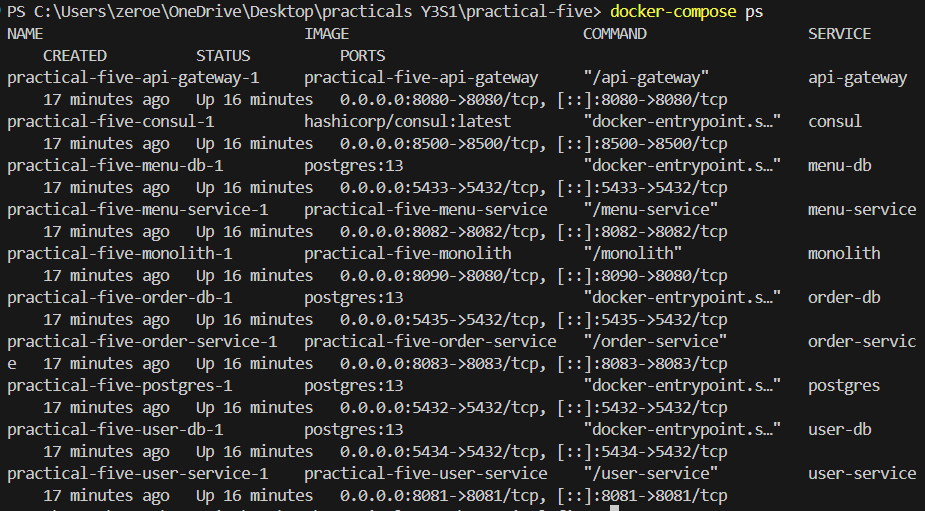
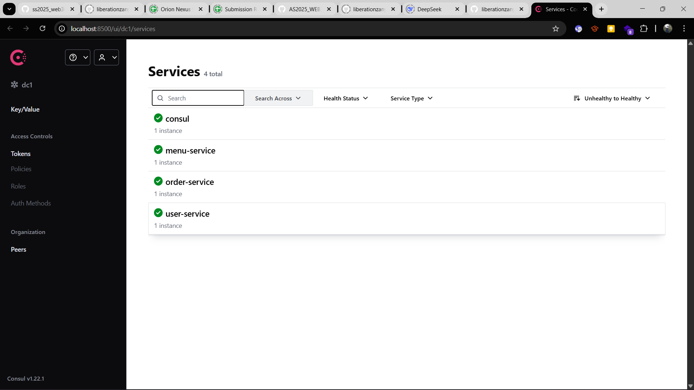
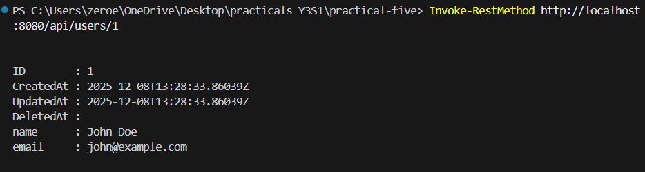
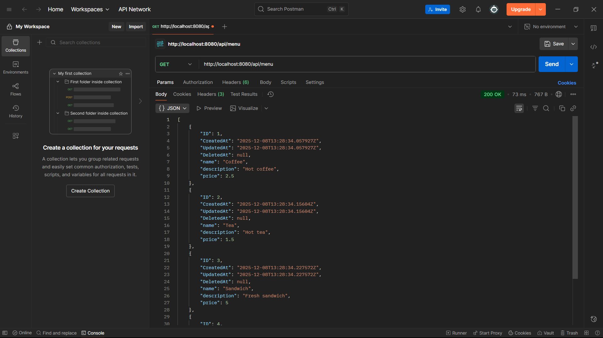
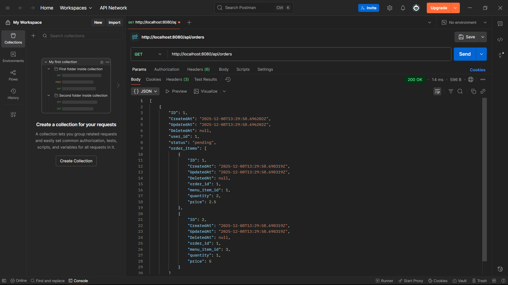
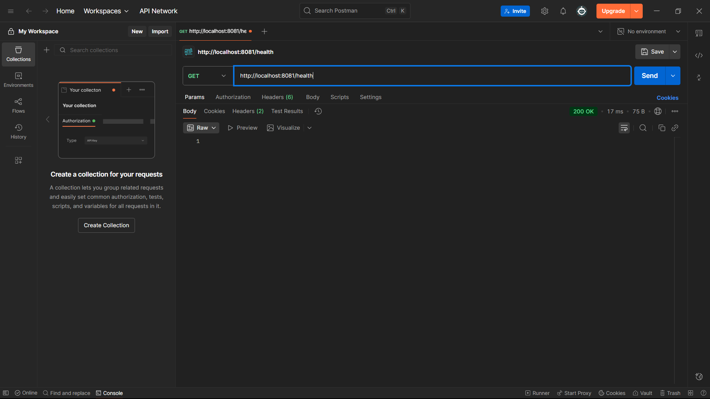
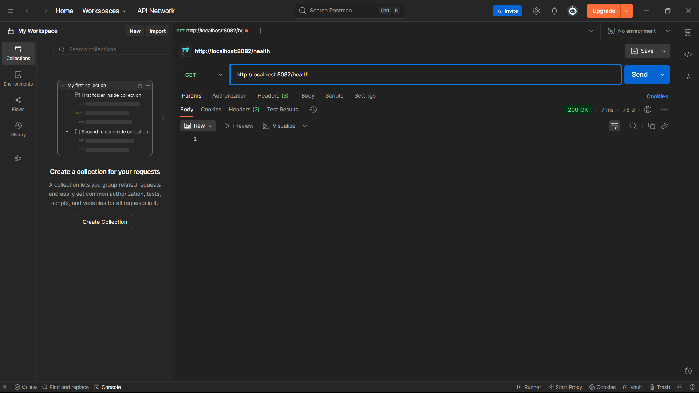

# Student Cafe Microservices Report

Use this file to paste or drag screenshots proving your system is running. Keep the order below for easy marking.

## 1 Docker & Services Up
- `docker-compose ps`
- `http://localhost:8500` Consul UI (services healthy)
_
- 
- 

## 2 API Gateway Responses
- `GET http://localhost:8080/api/users/1`
- `GET http://localhost:8080/api/menu`
- `GET http://localhost:8080/api/orders`

- 
- 
- 

## 3 Order Creation (Inter-service)
- `POST http://localhost:8080/api/orders` (body with user_id and items)
- Follow-up `GET http://localhost:8080/api/orders` showing the new order persisted

## 4 Health Checks (per service)
- `GET http://localhost:8081/health`
- `GET http://localhost:8082/health`
- `GET http://localhost:8083/health`

_Screenshot placeholders:_
- 
- 
- 

## 5 Environment Info
- Date: December 8, 2025
- Host OS: Windows (PowerShell)
- Ports: 8080 gateway, 8081 user, 8082 menu, 8083 order, 8090 monolith, 8500 Consul, 5432-5435 Postgres
