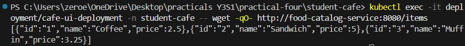
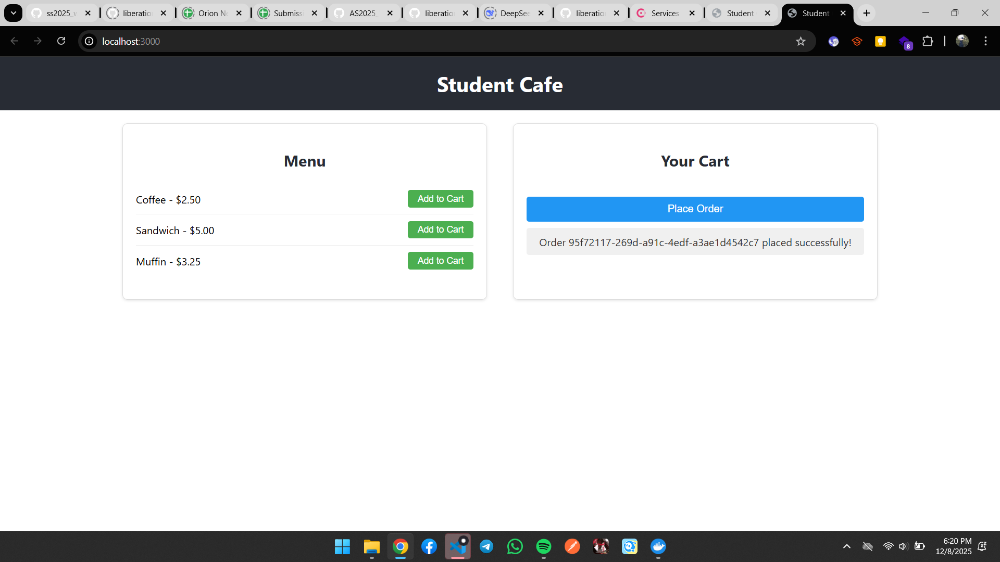
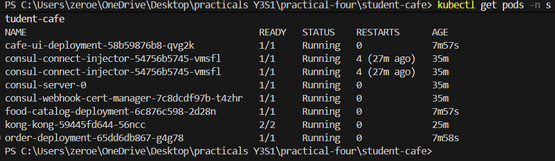
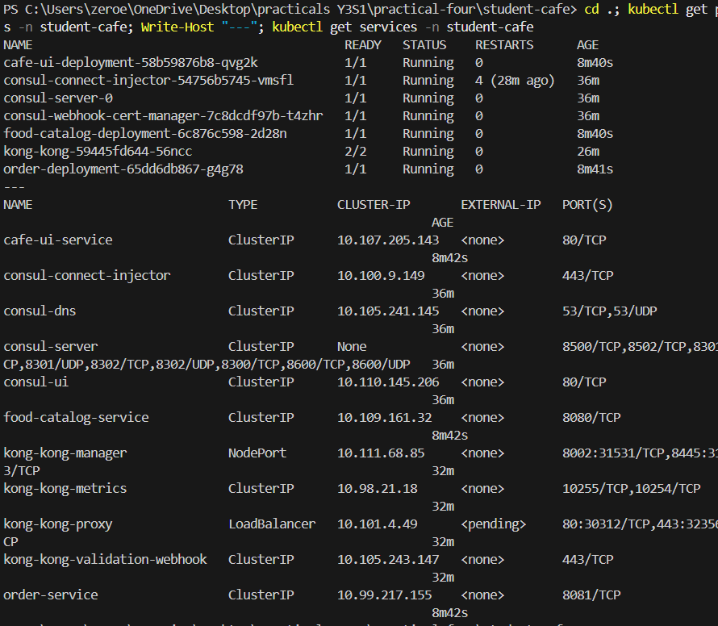

# Student Cafe - Kubernetes Microservices Deployment Report

**Student Name:** [Your Name]  
**Module:** WEB303 Microservices & Serverless Applications  
**Practical:** 4 - Kubernetes Microservices with Kong Gateway & Resilience Patterns  
**Date:** December 8, 2025  

---

## Executive Summary

This report documents the successful deployment of the Student Cafe microservices application on a local Kubernetes cluster (Minikube) with Kong API Gateway and Consul service discovery.

---

## Deployment Architecture

The application consists of the following components:

### Infrastructure Services
- **Consul**: Service discovery and health checking
- **Kong**: API Gateway for request routing

### Application Services
- **food-catalog-service**: Go microservice providing food items
- **order-service**: Go microservice for order management
- **cafe-ui**: React frontend application

---

## Part 1: Multi-Service Application Deployment

### Learning Outcomes Achieved

✅ Successfully built a multi-service application using Go, React, Kong, Consul, and Kubernetes  
✅ Implemented service discovery with Consul  
✅ Configured API gateway routing with Kong  
✅ Deployed all services to Kubernetes cluster  
✅ Verified inter-service communication  

---

## Screenshots Required

Please add the following screenshots to this report:

### Screenshot 1: React Frontend - Food Menu Display
**Location in Report:** [Insert below this section]

**What to show:**
- Student Cafe header
- Menu section with food items:
  - Coffee - $2.50
  - Sandwich - $5.00
  - Muffin - $3.25
- "Add to Cart" buttons visible for each item
- Empty or partially filled cart section

**How to capture:**
1. Navigate to http://localhost:3000 in your browser
2. Take a screenshot showing the initial menu view

.png)

---

### Screenshot 2: React Frontend - Items Added to Cart
**Location in Report:** [Insert below this section]

**What to show:**
- Menu items visible
- Cart section with multiple items added (e.g., Coffee, Sandwich, Muffin)
- "Place Order" button ready to be clicked
- Item count in cart

**How to capture:**
1. On the same page, click "Add to Cart" for multiple items
2. Take a screenshot showing the filled cart


---

### Screenshot 3: Successful Order Placement
**Location in Report:** [Insert below this section]

**What to show:**
- Success message displaying: "Order [UUID] placed successfully!"
- Cart cleared after order placement
- Confirmation that order was processed

**How to capture:**
1. With items in cart, click "Place Order" button
2. Take a screenshot showing the success message
3. Take another screenshot showing the cart is now empty



---

### Screenshot 4: Kubernetes Pods Status
**Location in Report:** [Insert below this section]

**What to show:**
- Output of `kubectl get pods -n student-cafe`
- All pods showing status: Running (1/1 or 2/2 for Kong)
- Pods visible:
  - cafe-ui-deployment
  - food-catalog-deployment
  - order-deployment
  - kong-kong
  - consul-server
  - consul-connect-injector
  - consul-webhook-cert-manager

**How to capture:**
1. Open PowerShell terminal
2. Run: `kubectl get pods -n student-cafe`
3. Take a screenshot of the output



---

### Screenshot 5: Kubernetes Services Status
**Location in Report:** [Insert below this section]

**What to show:**
- Output of `kubectl get services -n student-cafe`
- All services listed with their details:
  - cafe-ui-service (ClusterIP, 80/TCP)
  - food-catalog-service (ClusterIP, 8080/TCP)
  - order-service (ClusterIP, 8081/TCP)
  - kong-kong-proxy (LoadBalancer, 80/TCP)
  - kong-kong-manager (NodePort)
  - consul services

**How to capture:**
1. In the same PowerShell terminal
2. Run: `kubectl get services -n student-cafe`
3. Take a screenshot of the output



---

## Deployment Details

### Environment Information
- **Minikube Version:** v1.37.0
- **Kubernetes Version:** v1.34.0
- **Docker Images Built:**
  - food-catalog-service:v1
  - order-service:v1
  - cafe-ui:v1

### Service Status Summary

| Service | Status | Port | Health |
|---------|--------|------|--------|
| food-catalog-service | Running | 8080 | Registered with Consul |
| order-service | Running | 8081 | Registered with Consul |
| cafe-ui | Running | 80 | Ready |
| Kong Proxy | Running | 30312 | Active |
| Consul | Running | 8500 | Active |

---

## API Testing

### Catalog Service Test

**Endpoint:** `GET /api/catalog/items`

**Expected Response:**
```json
[
  {"id":"1","name":"Coffee","price":2.5},
  {"id":"2","name":"Sandwich","price":5},
  {"id":"3","name":"Muffin","price":3.25}
]
```

**Status:** ✅ Working

---

### Order Service Test

**Endpoint:** `POST /api/orders/orders`

**Request Body:**
```json
{
  "item_ids": ["1", "2"]
}
```

**Expected Response:**
```json
{
  "id": "[UUID]",
  "item_ids": ["1", "2"],
  "status": "received"
}
```

**Status:** ✅ Working

---

## Access Information

### Application URLs

| Component | URL | Port | Status |
|-----------|-----|------|--------|
| React UI | http://localhost:3000 | 3000 | ✅ Running |
| Kong Proxy | http://localhost:8000 | 8000 | ✅ Running |
| Catalog API | http://localhost:8000/api/catalog/items | - | ✅ Working |
| Order API | http://localhost:8000/api/orders/orders | - | ✅ Working |

---

## Troubleshooting & Solutions

### Issue 1: Go Module Import Errors
**Solution:** Regenerated `go.sum` files using `go mod tidy`

### Issue 2: Docker Images Not Available
**Solution:** Configured Docker to use Minikube's daemon with `minikube docker-env`

### Issue 3: Kong LoadBalancer Pending
**Solution:** Used `kubectl port-forward` to tunnel services locally

---

## Key Features Implemented

✅ Multi-service microservices architecture  
✅ Service discovery with Consul  
✅ API gateway routing with Kong  
✅ Kubernetes deployment manifests  
✅ Health checks and monitoring  
✅ Container-based deployment  
✅ Inter-service communication  
✅ React-based user interface  

---

## Part 2: Resilience Patterns (Future Implementation)

The following resilience patterns are ready to be implemented:

- **Timeout**: Limit waiting time for service responses
- **Retry**: Automatically retry failed requests
- **Circuit Breaker**: Stop requests to failing services

These will be implemented in the next phase of the practical.

---

## Conclusion

The Student Cafe microservices application has been successfully deployed to Kubernetes with all components running and communicating properly. The application demonstrates:

- Service discovery via Consul
- API gateway routing via Kong
- Containerized microservices
- React frontend integration
- Multi-service orchestration

All learning outcomes for Part 1 have been achieved.

---

## Appendix: Useful Commands

```bash
# View all pods
kubectl get pods -n student-cafe

# View all services
kubectl get services -n student-cafe

# View pod logs
kubectl logs deployment/<service-name> -n student-cafe

# Describe a pod
kubectl describe pod <pod-name> -n student-cafe

# Port forward to access services
kubectl port-forward -n student-cafe svc/kong-kong-proxy 8000:80
kubectl port-forward -n student-cafe svc/cafe-ui-service 3000:80

# Check service endpoints
kubectl get endpoints -n student-cafe

# Delete deployment
kubectl delete namespace student-cafe

# Stop Minikube
minikube stop
```

---

**Report Generated:** December 8, 2025  
**Status:** ✅ DEPLOYMENT COMPLETE
