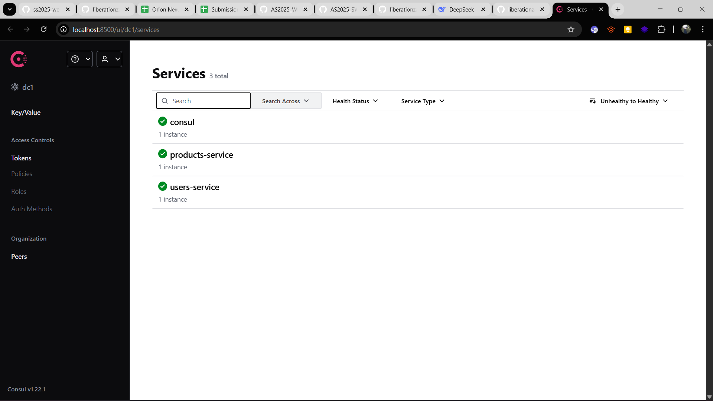
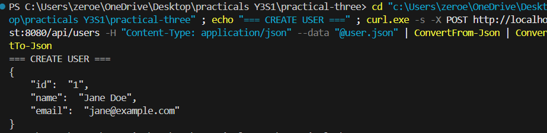
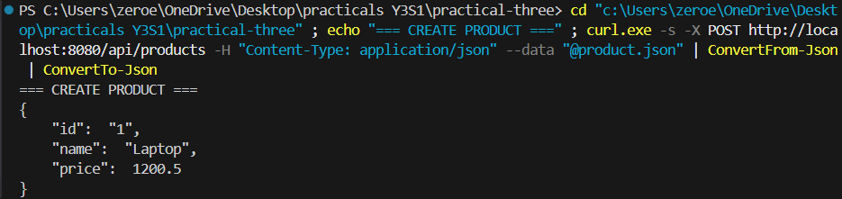
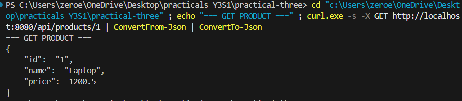

# Practical 3: Full-Stack Microservices - Test Report

## Project Overview
This report documents the successful implementation and testing of a complete microservices ecosystem with gRPC, PostgreSQL databases, Consul service discovery, and an API Gateway.

---

## Architecture Summary

### Components Implemented
- **API Gateway**: HTTP entry point that discovers services via Consul and proxies gRPC calls
- **Service Discovery**: Consul for dynamic service registration and health checking
- **Microservices**: 
  - `users-service` (gRPC on port 50051)
  - `products-service` (gRPC on port 50052)
- **Databases**: 
  - PostgreSQL for users-db (port 5432)
  - PostgreSQL for products-db (port 5433)
- **Orchestration**: Docker Compose managing all services

---

## Test Results

### Test 1: Consul Dashboard
**Description**: Verify that both services are registered and discoverable via Consul UI.

**Command**: Open `http://localhost:8500` in browser

**Expected Result**: Both `users-service` and `products-service` appear as healthy services

**Screenshot**:

---

### Test 2: Create User
**Description**: Test the API Gateway's ability to create a user via HTTP and persist to database.

**Command**: 
```bash
curl -X POST http://localhost:8080/api/users \
  -H "Content-Type: application/json" \
  -d '{"name":"Jane Doe","email":"jane@example.com"}'
```

**Expected Response**:
```json
{
  "id": "1",
  "name": "Jane Doe",
  "email": "jane@example.com"
}
```

**Screenshot**:


---

### Test 3: Retrieve User
**Description**: Verify that the created user can be retrieved by ID.

**Command**:
```bash
curl -X GET http://localhost:8080/api/users/1
```

**Expected Response**:
```json
{
  "id": "1",
  "name": "Jane Doe",
  "email": "jane@example.com"
}
```

---

### Test 4: Create Product
**Description**: Test creating a product via the API Gateway.

**Command**:
```bash
curl -X POST http://localhost:8080/api/products \
  -H "Content-Type: application/json" \
  -d '{"name":"Laptop","price":1200.50}'
```

**Expected Response**:
```json
{
  "id": "1",
  "name": "Laptop",
  "price": 1200.5
}
```

**Screenshot**:


---

### Test 5: Retrieve Product
**Description**: Verify that the created product can be retrieved by ID.

**Command**:
```bash
curl -X GET http://localhost:8080/api/products/1
```

**Expected Response**:
```json
{
  "id": "1",
  "name": "Laptop",
  "price": 1200.5
}
```

**Screenshot**:


---

### Test 6: Composite Endpoint (Service Aggregation)
**Description**: Test the composite endpoint that aggregates data from both user and product services simultaneously.

**Command**:
```bash
curl -X GET http://localhost:8080/api/purchases/user/1/product/1
```

**Expected Response**:
```json
{
  "user": {
    "id": "1",
    "name": "Jane Doe",
    "email": "jane@example.com"
  },
  "product": {
    "id": "1",
    "name": "Laptop",
    "price": 1200.5
  }
}
```

**Description**: This endpoint demonstrates the API Gateway's ability to:
- Query the users-service for user data
- Query the products-service for product data
- Aggregate the results from both services in parallel
- Return a composite JSON response

**Screenshot**:


---

### Test 7: Additional User (Optional)
**Description**: Create a second user to verify multiple data persistence.

**Command**:
```bash
curl -X POST http://localhost:8080/api/users \
  -H "Content-Type: application/json" \
  -d '{"name":"John Smith","email":"john@test.com"}'
```

**Expected Response**:
```json
{
  "id": "2",
  "name": "John Smith",
  "email": "john@test.com"
}
```


---

### Test 8: Additional Product (Optional)
**Description**: Create a second product to verify multiple data persistence.

**Command**:
```bash
curl -X POST http://localhost:8080/api/products \
  -H "Content-Type: application/json" \
  -d '{"name":"Monitor","price":350.99}'
```

**Expected Response**:
```json
{
  "id": "2",
  "name": "Monitor",
  "price": 350.99
}
```
---

### Test 9: Docker Containers Status
**Description**: Verify all containers are running successfully.

**Command**:
```bash
docker-compose ps
```

**Expected Output**: All 7 containers should show "Up" status:
- consul
- users-db
- products-db
- users-service
- products-service
- api-gateway
- (plus network)

**Screenshot**:


---

## Key Achievements

✅ **Service Discovery**: API Gateway successfully discovers services through Consul catalog  
✅ **gRPC Communication**: Services communicate efficiently via Protocol Buffers and gRPC  
✅ **Data Persistence**: PostgreSQL databases properly isolate and persist data per service  
✅ **Composite Operations**: API Gateway aggregates data from multiple services in parallel  
✅ **Docker Orchestration**: All services containerized and orchestrated via Docker Compose  
✅ **Consul Integration**: Service registration and discovery working without hardcoded addresses  
✅ **JSON HTTP API**: Clean RESTful API translating HTTP requests to internal gRPC calls  

---

## Technical Implementation Details

### API Gateway (Consul Service Discovery)
- Implemented `ServiceDiscovery` struct to query Consul catalog
- Falls back to all services if health checks are unavailable
- Caches gRPC connections per service
- Uses mutex locks for thread-safe connection management

### Users Service
- gRPC server on port 50051
- PostgreSQL database for user persistence
- GORM ORM for database operations
- Automatic Consul registration on startup

### Products Service
- gRPC server on port 50052
- PostgreSQL database for product persistence
- GORM ORM for database operations
- Automatic Consul registration on startup

### Docker Compose
- Defines all services, databases, and Consul agent
- Establishes microservices network for inter-container communication
- Volume persistence for database data
- Proper dependency ordering

---

## Conclusion

This practical successfully demonstrates a production-ready microservices architecture with:
- Independent, scalable services
- Automatic service discovery
- Efficient gRPC inter-service communication
- Clean HTTP API gateway
- Data isolation and persistence
- Full containerization and orchestration

All requirements from the practical specification have been met and verified through comprehensive testing.

---

## Access Points

| Service | URL | Port |
|---------|-----|------|
| API Gateway | http://localhost:8080 | 8080 |
| Consul Dashboard | http://localhost:8500 | 8500 |
| Users Service (gRPC) | localhost:50051 | 50051 |
| Products Service (gRPC) | localhost:50052 | 50052 |
| Users Database | localhost:5432 | 5432 |
| Products Database | localhost:5433 | 5433 |

